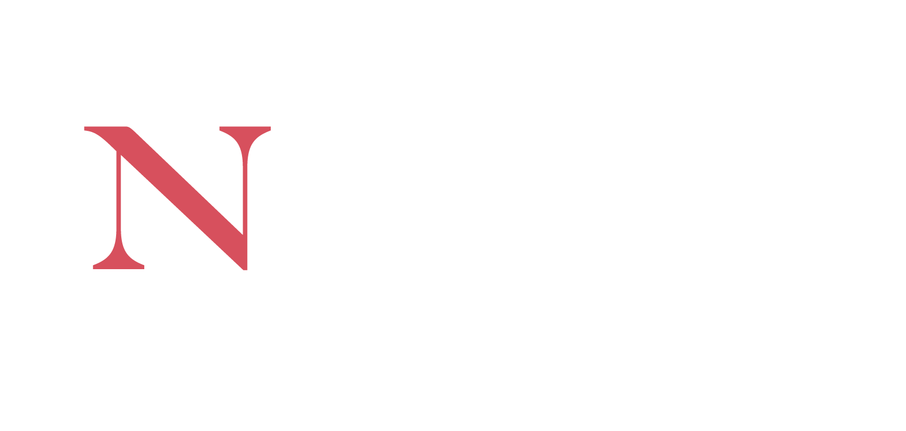
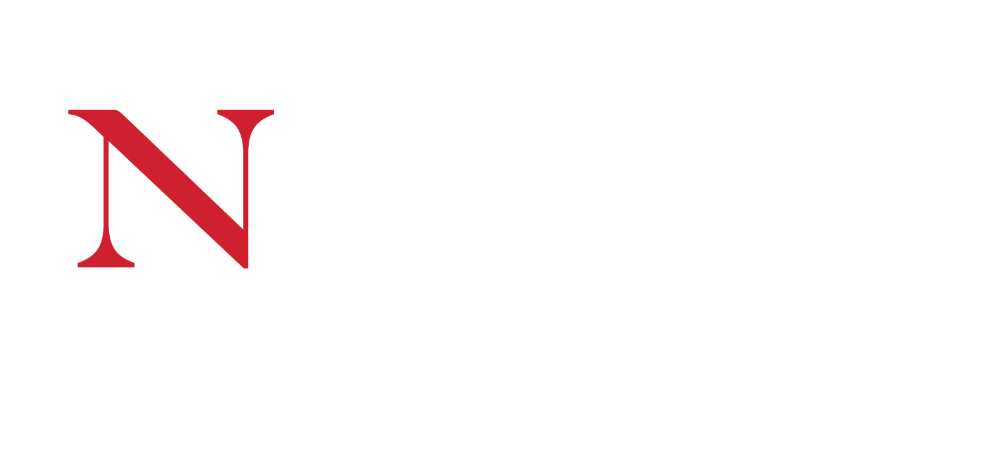
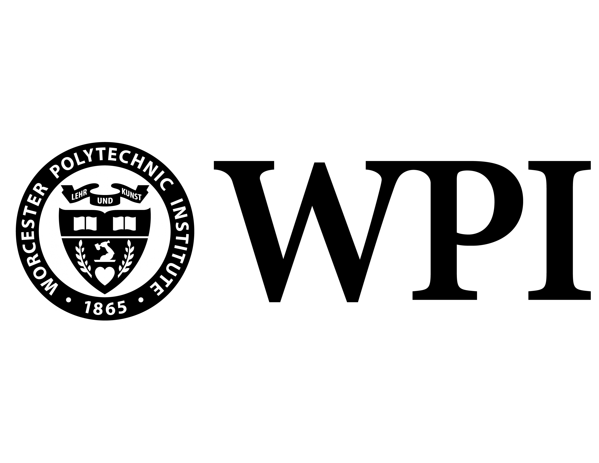

{ .center, width="75%" }

## Masters in Artificial Intelligence

At some point in my career, I want to pursue a Ph.D.

As an intermediate step towards this goal, I seized the opportunity that quarantining
during the COVID-19 pandemic offered in remote work at Wayfair to pursue double full-time
work and school.

Simultaneously leading engineering work on the **Data Catalog at Wayfair** and concentrating
my coursework on Natural Language Processing and Knowledge Representations strengthened
my understanding of the academic and practical applications of knowledge graphs and
information retrieval for database metadata.

The following are the course descriptions for each of the courses I completed during my
masters education (in order of semester):

### 2021 Fall

??? abstract "MATH7233: Graph Theory"

    Covers fundamental concepts in graph theory. Topics include adjacency and incidence
    matrices, paths and connectedness, and vertex degrees and counting; trees and distance
    including properties of trees, distance in graphs, spanning trees, minimum spanning
    trees, and shortest paths; matchings and factors including matchings in bipartite
    graphs, Hall&'s matching condition, and min-max theorems; connectivity, such as
    vertex connectivity, edge connectivity, k-connected graphs, and Menger's theorem;
    network flows including maximum network flow, and integral flows; vertex colorings,
    such as upper bounds, Brooks, theorem, graphs with large chromatic number, and critical
    graphs; Eulerian circuits and Hamiltonian cycles including Euler's theorem, necessary
    conditions for Hamiltonian cycles, and sufficient conditions; planar graphs including
    embeddings and Euler's formula, characterization of planar graphs (Kuratowski's theorem);
    and Ramsey theory including Ramsey's theorem, Ramsey numbers, and graph Ramsey theory.

??? abstract "CS5800: Algorithms"

    Presents the mathematical techniques used for the design and analysis of computer
    algorithms. Focuses on algorithmic design paradigms and techniques for analyzing
    the correctness, time, and space complexity of algorithms. Topics may include
    asymptotic notation, recurrences, loop invariants, Hoare triples, sorting and
    searching, advanced data structures, lower bounds, hashing, greedy algorithms,
    dynamic programming, graph algorithms, and NP-completeness.

### 2022 Spring

??? abstract "CS6120: Natural Language Processing"

    Provides an introduction to the computational modeling of human language, the ongoing
    effort to create computer programs that can communicate with people in natural language,
    and current applications of the natural language field, such as automated document
    classification, intelligent query processing, and information extraction. Topics include
    computational models of grammar and automatic parsing, statistical language models and
    corpora understand language, models of discourse structure, and language use by intelligent
    agents. Course work includes formal and mathematical analysis of language models, and
    implementation of working programs that analyze and interpret natural language text.

??? abstract "CS6140: Machine Learning"

    Provides a broad look at a variety of techniques used in machine learning and data
    mining, and also examines issues associated with their use. Topics include algorithms
    for supervised learning including decision tree induction, artificial neural networks,
    instance-based learning, probabilistic methods, and support vector machines;
    unsupervised learning; and reinforcement learning. Also covers computational learning
    theory and other methods for analyzing and measuring the performance of learning
    algorithms. Course work includes a programming term project.

### 2022 Fall

??? abstract "CS5180: Reinforcement Learning"

    Introduces reinforcement learning and the underlying computational frameworks and
    the Markov decision process framework. Covers a variety of reinforcement learning
    algorithms, including model-based, model-free, value function, policy gradient,
    actor-critic, and Monte Carlo methods. Examines commonly used representations
    including deep learning representations and approaches to partially observable
    problems. Students are expected to have a working knowledge of probability and linear
    algebra, to complete programming assignments, and to complete a course project that
    applies some form of reinforcement learning to a problem of interest.

??? abstract "CS6200: Information Retrieval"

    Provides an introduction to information retrieval systems and different approaches to
    information retrieval. Topics covered include evaluation of information retrieval
    systems; retrieval, language, and indexing models; file organization; compression;
    relevance feedback; clustering; distributed retrieval and meta-search; probabilistic
    approaches to information retrieval; Web retrieval; filtering, collaborative filtering,
    and recommendation systems; cross-language IR; multimedia IR; and machine learning for
    information retrieval.

### 2023 Spring

??? abstract "CS5100: Foundations of Artificial Intelligence"

    Introduces the fundamental problems, theories, and algorithms of the artificial
    intelligence field. Topics include heuristic search and game trees, knowledge
    representation using predicate calculus, automated deduction and its applications,
    problem solving and planning, and introduction to machine learning. Required course
    work includes the creation of working programs that solve problems, reason logically,
    and/or improve their own performance using techniques presented in the course. Requires
    experience in Java programming.

??? abstract "CS5340: Human-Computer Interaction"

    Covers the principles of human-computer interaction and the design and evaluation of
    user interfaces. Topics include an overview of human information processing subsystems
    (perception, memory, attention, and problem solving); how the properties of these
    systems affect the design of user interfaces; the principles, guidelines, and
    specification languages for designing good user interfaces, with emphasis on tool kits
    and libraries of standard graphical user interface objects; and a variety of interface
    evaluation methodologies that can be used to measure the usability of software. Other
    topics may include World Wide Web design principles and tools, computer-supported
    cooperative work, multimodal and “next generation” interfaces, speech and natural
    language interfaces, and virtual reality interfaces. Course work includes both the
    creation and implementation of original user interface designs, and the evaluation of
    user interfaces created by others. Requires knowledge of C programming language/UNIX.

{ .center, width="75%" }

## Bachelors of Science in Mathematics

After transferring 1-2 years of credits from high school, I entered my undergraduate
degree Undeclared. As part of my exploration through programs at Northeastern, I bounced
from Computer Science to Music Technology and finally landed on Mathematics as a practical
extension of my passion for Philosophy.

Below are categorized lists of relevant courses I completed during my bachelors degree:

=== "Mathematics"

    |        Number | Name                                        |
    |--------------:|:--------------------------------------------|
    |  **MATH2351** | Ordinary Differential Equation              |
    |  **MATH3081** | Probability and Statistics                  |
    |  **MATH3150** | Real Analysis                               |
    |  **MATH3175** | Group Theory                                |
    |  **MATH3331** | Elementary Differential Geometry            |
    |  **MATH3527** | Number Theory                               |
    |  **MATH3533** | Combinatorial Mathematics                   |
    |  **MATH4581** | Statistics & Stochastic Procsses            |
    |  **MATH4681** | Probability and Risks                       |
    |  **MATH5131** | Introduction to Math Methods & Models       |

=== "Computer Science"

    |      Number | Name                                        |
    |------------:|:--------------------------------------------|
    |  **CS1800** | Discrete Structures                         |
    |  **CS2500** | Fundamentals of Computer Science 1 (HONORS) |
    |  **CS2800** | Logic and Computation                       |

=== "Other"

    |        Number | Name                                        |
    |--------------:|:--------------------------------------------|
    |  **MUSC1201** | Music Theory 1                              |
    |  **MUST1220** | Introduction to Music Technology            |
    |  **PHYS1151** | Physics for Engineering 1                   |
    |  **POLS1150** | American Government                         |
    |  **RELS1260** | Apocalypticism in Film                      |

{ .center, width="75%" }

## High School Diploma

At the **Massachusetts Academy for Math and Science**, senior year of high school consisted
of a full course-load at **Worcester Polytechnic Institute (WPI)** and two senior projects.
Combined with my taking AP Calculus B/C in my sophomore year at **Mount Saint Charles**,
I transferred into Northeastern University as a freshman with the following credits:

|       Number | Name                                     |
|-------------:|:-----------------------------------------|
| **CHEM1211** | General Chemistry                        |
| **ENGL4520** | American Novels 2                        |
| **ENGL4667** | American Realism                         |
| **MATH1341** | Calculus 1 for Science / Engineering     |
| **MATH1342** | Calculus 2 for Science / Engineering     |
| **MATH1365** | Introduction to Logic and Math Reasoning |
| **MATH2321** | Calculus 3 for Science / Engineering     |
| **MATH2331** | Linear Algebra                           |
| **PHIL1101** | Introduction to Philosophy               |
| **PHIL1990** | Elective: Existentialism                 |
| **PHYS2303** | Modern Physics                           |
